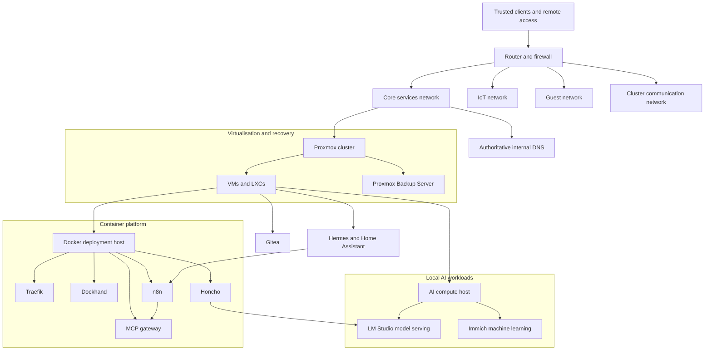

# Maksymilian's homelab

A multi-node homelab used to practise infrastructure engineering, network design, reliable deployments, automation and self-hosted AI.

This repository is a public, sanitised view of the environment. It focuses on the engineering decisions, operational lessons and selected examples that can be shared safely. Exact inventory, credentials and production configuration remain private.

## Why I built it

Coursework gave me isolated labs. I wanted an environment where services depend on each other, changes have consequences, and recovery matters as much as deployment.

The lab lets me work with:

- Linux systems, virtual machines and containers;
- segmented networking, internal DNS and remote access;
- Git-managed Docker deployments;
- backups, health checks and rollback procedures;
- workflow automation across APIs and services;
- local language models and GPU-constrained AI workloads.

## Architecture at a glance



The diagram shows roles and trust boundaries rather than operational addresses or hostnames. See [Architecture](docs/architecture.md) for the expanded view.

## Technical highlights

| Area | What I implemented | Evidence |
| --- | --- | --- |
| Virtualisation | Multi-node Proxmox environment with VMs, LXCs and a separate cluster network | [Proxmox platform case study](docs/case-studies/proxmox-platform.md) |
| Networking | Segmented core, IoT, guest and cluster traffic with internal DNS and VPN access | [Architecture](docs/architecture.md#network-boundaries) |
| Delivery | Gitea-based configuration workflow, reviewed changes, Dockhand deployment and post-deployment checks | [Git-managed deployment case study](docs/case-studies/gitops-deployment.md) |
| Recovery | Proxmox backups, explicit rollback thinking and health verification after changes | [Operations and recovery](docs/architecture.md#resilience-and-recovery) |
| Automation | n8n and Hermes workflows integrating APIs, structured data and home infrastructure | [Automation flow](docs/architecture.md#automation-and-ai-flow) |
| AI operations | Local model serving, memory services and GPU capacity planning alongside media ML workloads | [Self-hosted AI case study](docs/case-studies/self-hosted-ai.md) |

## Case studies

### [Proxmox platform and segmented networking](docs/case-studies/proxmox-platform.md)

How I separated infrastructure roles, cluster traffic, services and recovery concerns across a constrained home environment.

### [Git-managed Docker deployments](docs/case-studies/gitops-deployment.md)

How Gitea, pull requests, Dockhand and runtime health checks provide a safer path from configuration change to running service.

### [Self-hosted AI under resource constraints](docs/case-studies/self-hosted-ai.md)

How I separated AI compute, selected lightweight local models and balanced persistent memory workloads against GPU capacity needed by other services.

## How I approach infrastructure work

1. Inspect the live system before changing it.
2. Record the current state and identify a rollback path.
3. Keep non-secret configuration in Git.
4. Separate runtime secrets from version-controlled files.
5. Change one layer at a time when possible.
6. Verify the result from the service and client side.
7. Document failures and the reasoning behind the final design.

The lab is intentionally imperfect. Its purpose is to make constraints, failures and trade-offs visible enough to learn from them.

## Skills demonstrated

- Proxmox VE, KVM and LXC
- Linux system administration
- Docker and Docker Compose
- Git, Gitea and pull-request workflows
- network segmentation, VLANs, DNS and VPN access
- Traefik and internal service routing
- backup and recovery planning
- n8n workflow automation and API integration
- local LLM serving and AI workload planning
- technical documentation and incident analysis

## Repository map

```text
docs/
├── architecture.md
├── engineering-decisions.md
├── security-and-privacy.md
└── case-studies/
    ├── proxmox-platform.md
    ├── gitops-deployment.md
    └── self-hosted-ai.md

examples/
└── README.md
```

The `examples` directory will contain selected, sanitised configuration fragments. The repository will not mirror the private deployment repositories.

## Security and privacy

This repository deliberately excludes:

- credentials, tokens, private keys and certificate material;
- real public addresses, MAC addresses and device serial numbers;
- complete firewall, VPN or remote-access configurations;
- unredacted environment files and application exports;
- backup destinations and other details that would meaningfully reduce security.

The full policy and publication checklist are in [Security and privacy](docs/security-and-privacy.md).

## Current status

This is the first documentation draft. The next useful additions are a visual architecture diagram, sanitised configuration examples and verification evidence for each case study.

## Author

[Maksymilian Piast](https://github.com/M0zzi3)<br>
Final-year Electronics-ICT student, specialising in System, Services and Security.
