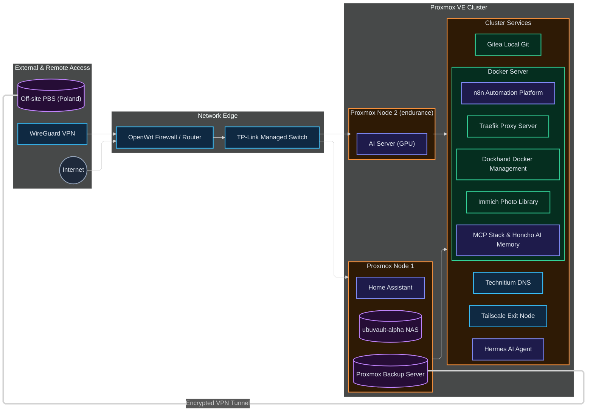

# Maksymilian's homelab

A multi-node homelab where I practise infrastructure engineering, networking, automation and self-hosted AI beyond isolated classroom exercises.

I use it to design services, deploy them, troubleshoot failures and improve how they are recovered. This repository is a sanitised portfolio view; the live inventory, credentials and deployment configuration remain private.

## Overview

The environment is built around:

- a multi-node Proxmox cluster with a separate cluster network;
- OpenWrt, managed switching, VLAN segmentation, internal DNS and WireGuard;
- a central Docker host using Gitea, Dockhand and Traefik;
- local and off-site Proxmox backups;
- a NAS used by stateful applications such as Immich;
- a distributed JARVIS stack using Hermes, n8n, MCP, Honcho and local AI.

## What this demonstrates

| Area | Evidence |
| --- | --- |
| Virtualisation and networking | [Architecture](docs/architecture.md) and [Proxmox case study](docs/case-studies/proxmox-platform.md) |
| Systems and data ownership | [System catalogue](docs/systems.md) |
| Deployment, backup and recovery | [Operations](docs/operations.md) and [GitOps case study](docs/case-studies/gitops-deployment.md) |
| Local AI and agent automation | [Self-hosted AI case study](docs/case-studies/self-hosted-ai.md) |

## Main systems

| System | Purpose |
| --- | --- |
| Technitium DNS | Internal DNS and custom local service names |
| Docker deploy | Container platform, CI/CD and reverse proxy |
| AI server | Local model serving and Immich machine learning |
| Gitea | Source control, reviews and GitHub mirrors |
| Hermes | JARVIS runtime and tool orchestration |
| Home Assistant | Smart-home control and local integrations |
| ubuvault-alpha | NAS and persistent media storage |
| Proxmox Backup Server | Local recovery and off-site replication to Poland |

The [system catalogue](docs/systems.md) explains where each system fits without exposing operational access details.

## Featured case studies

### [Proxmox platform](docs/case-studies/proxmox-platform.md)

How I separated compute, cluster communication, services and recovery concerns in a constrained home environment.

### [Git-managed Docker deployments](docs/case-studies/gitops-deployment.md)

How configuration moves from a Gitea branch through review, Dockhand deployment and post-deployment verification.

### [Self-hosted AI](docs/case-studies/self-hosted-ai.md)

How I balance local language models, memory services and Immich ML on limited GPU, memory and storage capacity.

## Working principles

- inspect the live system before changing it;
- keep non-secret configuration in Git;
- define a rollback path before consequential changes;
- verify useful behaviour, not only process status;
- document failures and trade-offs honestly.

## Security

This repository does not contain credentials, private keys, live addresses, complete firewall or VPN configuration, personal data, private automation payloads or exact backup destinations. See [SECURITY.md](SECURITY.md).

## Current work

The foundational architecture and subsystem diagrams have been integrated. The next additions are verified Proxmox resource allocations, selected sanitised configuration examples and measured recovery evidence.

## Author

[Maksymilian Piast](https://github.com/M0zzi3) 
Final-year Electronics-ICT student, specialising in System, Services and Security.
