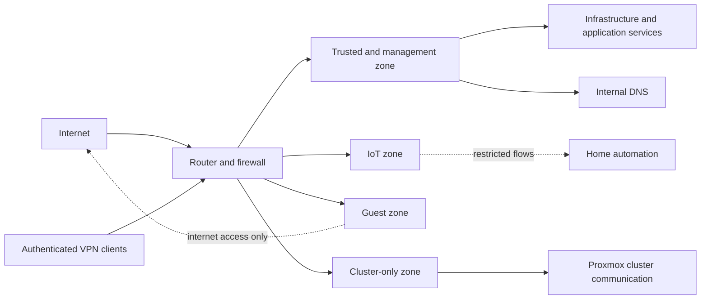
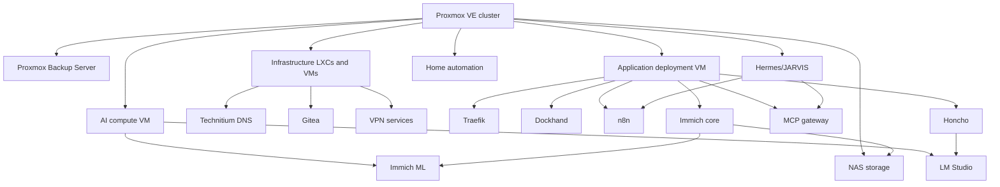
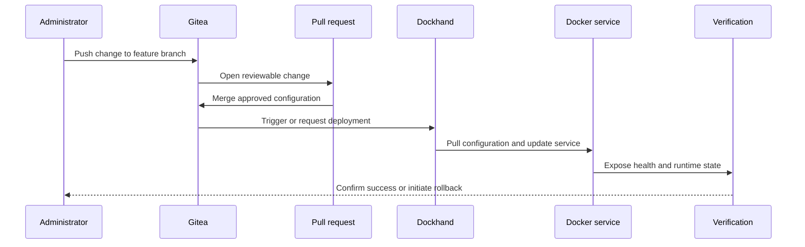
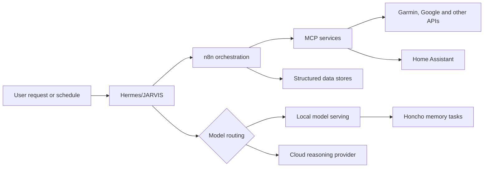

# Architecture

## Scope

This page describes the logical shape of the homelab. It is not a complete inventory and does not expose operational addresses, credentials or remote-access configuration.

The environment is split into four concerns:

1. network boundaries and name resolution;
2. virtualisation and recovery;
3. application delivery and automation;
4. local AI compute.

## Network boundaries

### Design intent

- Trusted clients can reach administration interfaces when required.
- IoT devices are isolated from general client and management traffic.
- Guest devices do not receive access to internal services.
- Proxmox cluster communication uses a dedicated segment.
- Remote administration enters through authenticated VPN access rather than direct service exposure.
- Internal DNS provides stable service names independently of individual application ports.

The operational firewall rules and address plan remain private. Public examples will use fictional networks and hostnames.

## Compute and service topology

### Placement principles

- Core infrastructure services are separated from user-facing application stacks.
- AI workloads run on a host with access to the available GPU.
- Deployment configuration is tracked separately from runtime secrets.
- Backups are not stored only with the workloads they protect.
- Application routing is centralised while service data remains owned by each application.

## Deployment flow

Not every stack is fully automated. The important property is that a change has an identifiable source revision and an explicit verification step.

## Automation and AI flow

Routine memory and embedding work can remain local. More demanding reasoning can use a cloud provider. This keeps persistent workloads modest while preserving access to stronger models when needed.

## Resilience and recovery

The recovery model uses several layers:

- Proxmox backups for guests;
- application-specific persistent data and export procedures;
- Git history for non-secret deployment configuration;
- service health checks after updates;
- rollback to a known-good revision when an update fails;
- separate documentation for steps that cannot be reconstructed automatically.

This is not presented as zero-downtime infrastructure. The goal is predictable recovery with clear ownership of state.

## Known limitations

- Some services are configured through web interfaces and are not yet fully reproducible from Git.
- Hardware capacity and redundancy are limited by a residential budget and power envelope.
- Monitoring coverage differs between infrastructure layers.
- Several documentation pages still need measured verification evidence.

These limitations form the roadmap for future improvements rather than being hidden behind a "production-grade" label.

## Detailed documentation

- [Infrastructure overview](infrastructure/index.md)
- [Proxmox cluster](infrastructure/proxmox-cluster.md)
- [Network architecture](infrastructure/network.md)
- [Backup and off-site replication](infrastructure/backup-and-replication.md)
- [System catalogue](systems/index.md)
- [Docker platform](platforms/docker-platform.md)
- [JARVIS platform](platforms/jarvis-platform.md)
- [Immich](services/immich.md)
