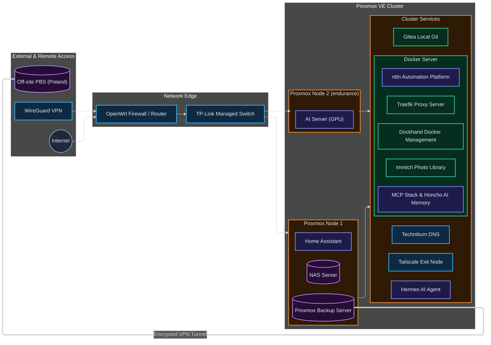
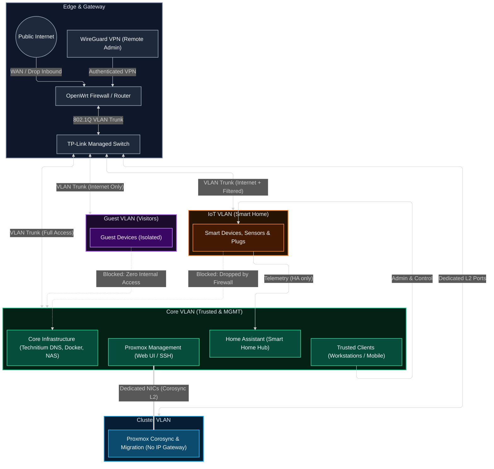
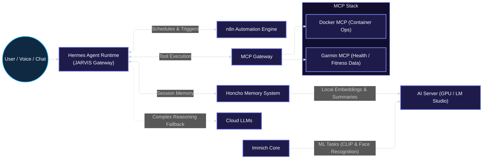
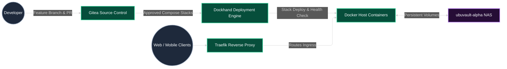
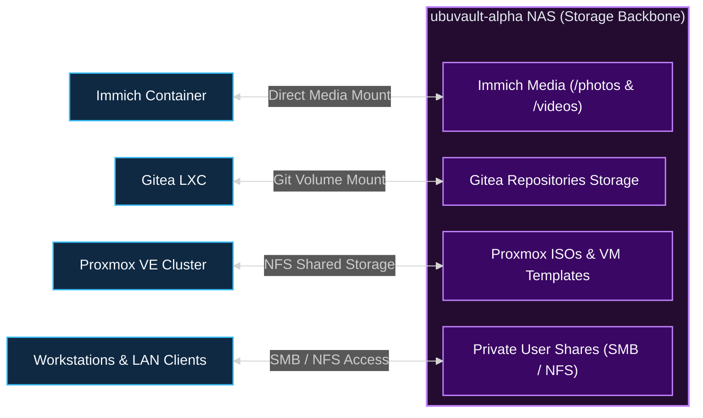
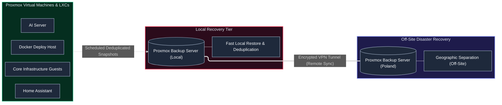

# Architecture

This page describes the homelab at a portfolio level. It explains the main boundaries and dependencies without reproducing the live address plan or private configuration.

## Architecture layers

### Network

OpenWrt provides routing, firewalling and DHCP. A managed switch carries the required VLANs. Technitium provides internal DNS, and WireGuard provides authenticated remote access.

The public model shows four network purposes:

- core infrastructure and trusted clients;
- IoT devices;
- guest access;
- Proxmox cluster communication.

### Compute and storage

Proxmox hosts the main VMs and LXCs. Workloads are separated by responsibility: infrastructure, container applications, AI compute, home automation, JARVIS, NAS storage and backup.

A local Proxmox Backup Server provides the first restore path. A second PBS in Poland stores an off-site copy over the VPN. The final documentation will name the sync direction only after the running job has been checked.

### Applications and automation

The Docker host runs Traefik, Dockhand, n8n, the MCP stack, Honcho and Immich core services. Immich stores its media on the NAS and sends machine-learning work to the AI server.

Hermes is the visible JARVIS runtime. n8n owns durable automation, MCP exposes authorised integrations, Honcho handles conversational memory, and the AI server provides local inference.

## Diagram 1: homelab overview

## Diagram 2: network and trust boundaries

Include:

- OpenWrt;
- managed switch;
- core, IoT, guest and cluster VLANs;
- Technitium DNS;
- WireGuard remote access;
- permitted and restricted flows.

Use one colour per trust zone. Show the purpose of a boundary rather than the complete firewall rule set.

## Diagram 3: Subsystem interconnections and application flows

These diagrams detail the functional lifecycles and cross-system data flows that operate across the infrastructure.

### 3.1 AI and automation stack (JARVIS platform)

Shows conversational prompt handling, agent orchestration via Hermes, durable automation in n8n, tool integration through the MCP stack, conversational memory in Honcho, local GPU inference, and cloud fallback.

### 3.2 GitOps and container delivery pipeline

Traces the path from code changes and PR reviews in Gitea through automated Dockhand deployment to the Docker host, reverse-proxy ingress via Traefik, and persistent storage mounts.

### 3.3 Central storage architecture (ubuvault-alpha NAS)

Details how the NAS functions as the shared high-capacity storage backbone across virtual machines, containers, and hypervisors.

### 3.4 Backup and disaster recovery pipeline

Illustrates the tiered recovery strategy: scheduled deduplicated guest backups to the local Proxmox Backup Server, followed by encrypted remote replication over VPN to Poland PBS.

## Diagram standards

Diagrams are maintained as native, version-controlled Mermaid diagrams directly within the repository markdown pages:

- **Theme:** Dark theme with high-contrast functional color-coding.
- **Layout Engine:** ELK (`layout: elk`) with linear orthogonal edge routing (`curve: linear`).
- **Boundaries:** Clear conceptual trust and execution zones with explicit direction of data and authority flow.
