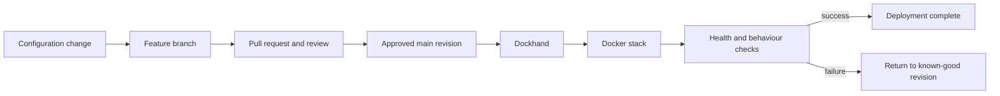

# Git-managed Docker deployments

## Context

Several services originally depended on configuration held in application interfaces or manually maintained Compose files. That made it harder to answer three basic questions: what changed, which version is running, and how do I return to the previous state?

## Problem

A safer deployment process needed:

- a visible history of non-secret configuration;
- review before consequential changes;
- separation between configuration and credentials;
- a repeatable deployment path;
- post-deployment verification;
- a practical rollback target.

## Decision

I use a self-hosted Gitea instance for source control and keep deployment-focused repositories for Docker stacks. Changes are prepared on feature branches and reviewed through pull requests. Dockhand reads approved configuration and applies the stack to the target Docker host. Secret values remain outside Git.



## Repository principle

Deployment repositories contain the smallest material needed to express and update a stack:

```text
service/
├── compose.yml
├── example.env
├── README.md
└── operational notes
```

They do not contain copied upstream source code, live secrets or unrelated administration tools.

## Verification

A deployment is not considered complete because a container reached `running`. Verification may include:

- container health status;
- expected environment identifiers without printing secret values;
- application health endpoints;
- connectivity through the intended reverse-proxy route;
- dependent service behaviour;
- logs checked for new startup errors.

## Failure and rollback

When a change causes an incident, the first objective is to restore service. The clean redesign can wait until the known-good configuration is running again.

A rollback uses the last known-good Git revision together with the preserved runtime data and secrets. This works only when application data compatibility has also been considered; returning a Compose file does not reverse an incompatible database migration.

## Lessons learned

- "Configuration in Git" is not the same as full disaster recovery.
- A clean deployment repository is easier to review than a copy of the upstream project.
- Secrets need their own documented recovery process.
- Health checks must test useful behaviour, not merely process existence.
- Pull requests make infrastructure reasoning visible even in a one-person lab.

## Evidence to add

- one sanitised Compose example;
- a pull-request screenshot with sensitive data removed;
- a deployment verification transcript;
- one rollback exercise;
- a simple CI check for YAML, links and accidental secret patterns.

## What I would change in a professional environment

- dedicated staging and production environments;
- automated policy and security checks;
- managed secret storage with rotation;
- signed artifacts and stronger supply-chain controls;
- deployment approvals tied to identities and audit logs;
- defined recovery objectives and database migration procedures.

## Skills demonstrated

Git, Gitea, pull requests, Docker Compose, Dockhand, configuration management, secret separation, service verification, rollback planning and incident response.
