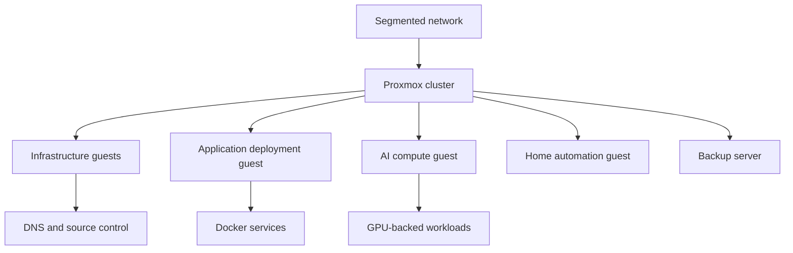

# Proxmox platform and segmented networking

## Context

I wanted a persistent environment for learning system administration, networking and service operations outside isolated university labs. The platform needed to host infrastructure, applications, home automation and AI workloads without treating every service as though it belonged on one Docker machine.

## Problem

The environment had to balance several conflicting goals:

- enough separation to practise realistic infrastructure patterns;
- modest hardware, power and storage requirements;
- support for both VMs and lightweight containers;
- recoverability when an experiment or update failed;
- network boundaries for trusted clients, guests, IoT devices and cluster traffic.

## Decision

I selected Proxmox VE as the platform layer and use a mixture of VMs and LXCs. Application containers run inside selected guests. Cluster communication is separated from general services, and Proxmox Backup Server provides guest-level recovery.

## Network model

The public model uses role-based zones rather than live addresses:

| Zone | Purpose | General policy |
| --- | --- | --- |
| Trusted/core | Administration and infrastructure services | Restricted to trusted clients and required service flows |
| IoT | Smart-home and embedded devices | Isolated from management; only required flows allowed |
| Guest | Visitor devices | Internet access without internal service access |
| Cluster | Proxmox cluster communication | Used only for cluster-related traffic |
| VPN | Authenticated remote administration | Provides controlled entry to approved internal services |

## What I learned

- VM and LXC placement is an operational decision, not only a resource calculation.
- Cluster communication deserves its own failure and traffic assumptions.
- A hypervisor backup is only one part of application recovery.
- Infrastructure names and documentation reduce troubleshooting time when the environment grows.
- Network segmentation is useful only when the allowed flows are understood and tested.

## Verification evidence to add

This first draft intentionally avoids invented results. Planned evidence includes:

- sanitised node and guest inventory;
- example backup verification and restore test;
- diagram of the physical and logical network layers;
- representative DNS and routing checks;
- a short failover or recovery exercise with measured timings.

## What I would change in a professional environment

- redundant switching and power paths;
- centralised authentication and audited administrative access;
- consistent configuration management for every guest;
- broader monitoring and log retention;
- scheduled restore testing with documented recovery objectives;
- formal capacity and lifecycle planning.

## Skills demonstrated

Proxmox VE, Linux, KVM, LXC, network segmentation, VLANs, DNS, VPN access, backup planning, troubleshooting and technical documentation.
