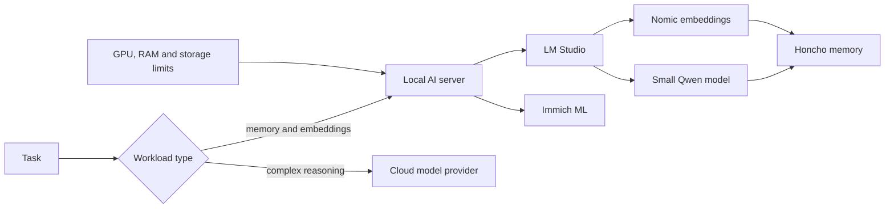

# Self-hosted AI under resource constraints

## Context

I use local language models for persistent memory and auxiliary tasks while reserving stronger cloud models for work that requires more reasoning capacity. The same GPU host also supports media machine-learning workloads, so model selection cannot be separated from infrastructure capacity.

## Problem

The AI environment needed to support:

- a small always-available language model;
- local embeddings;
- persistent memory processing;
- occasional media machine-learning jobs;
- room for future experiments;
- predictable failure behaviour when a local model is unavailable or unsuitable.

Loading the largest model that fits once is not a capacity plan. Runtime overhead, context, concurrency and competing workloads matter.

## Decision

LM Studio provides local model serving on the AI host. Honcho uses a small Qwen model for memory derivation, summaries and routine dialectic work, together with a Nomic embedding model. More demanding reasoning remains on the main JARVIS provider path.

## Capacity considerations

- Model file size is not total runtime memory use.
- Context length and KV cache consume additional memory.
- Concurrency can multiply resource use.
- Persistent models reduce cold-start latency but hold capacity.
- Media ML workloads need enough headroom to run without destabilising memory services.
- Disk pressure can become as important as GPU memory when multiple model variants are stored.

## Operational approach

1. Keep the persistent local workload small and predictable.
2. Load models explicitly rather than relying on accidental auto-load behaviour.
3. Verify model identifiers through the serving API.
4. Confirm Honcho health and perform a real search/reasoning request after configuration changes.
5. Monitor resource pressure before increasing model size or context.
6. Route hard reasoning to a provider designed for it.

## Failure encountered

A model may answer normal chat requests while failing when an application expects tool-use or structured behaviour. Compatibility must therefore be tested through the consuming application, not inferred from a successful chat completion.

## Verification evidence to add

- sanitised model-serving architecture;
- model and embedding health checks;
- representative Honcho search and reasoning test;
- GPU memory observations under normal load;
- a comparison of model size, latency and reliability;
- recovery behaviour when local inference is unavailable.

## Lessons learned

- The best local model is the one that remains reliable alongside the rest of the platform.
- Workload routing is often more useful than forcing one model to handle everything.
- Successful model loading does not prove application compatibility.
- Capacity headroom is an operational feature, not wasted hardware.
- Configuration changes need end-to-end verification through the actual consumer.

## What I would change in a professional environment

- a headless inference server with explicit lifecycle management;
- central metrics for latency, failures, memory use and queue depth;
- formal evaluation sets for each workload;
- privacy classification before routing data externally;
- request tracing across memory, model and orchestration services;
- automated fallback and load-shedding policies.

## Skills demonstrated

Local model serving, AI infrastructure, model routing, GPU capacity planning, embeddings, containerised services, API verification, reliability testing and technical trade-off analysis.
