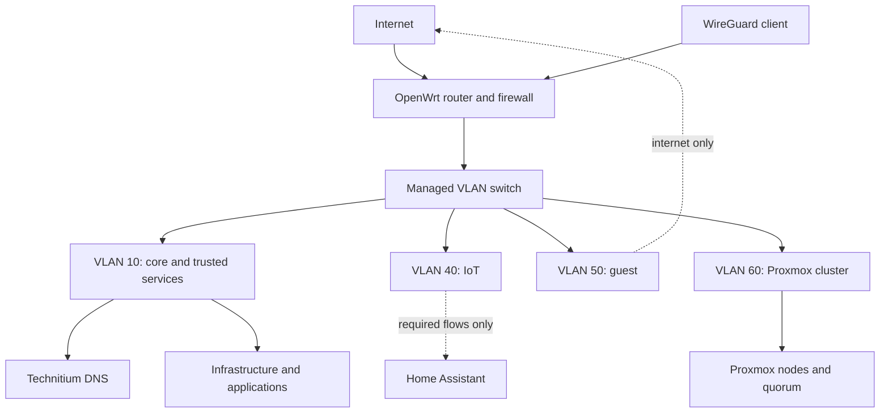

# Network architecture

## Components

| Component | Responsibility |
| --- | --- |
| OpenWrt router | Internet gateway, firewall, DHCP and VLAN routing |
| Managed switch | Access and trunk ports carrying the required VLANs |
| Technitium DNS | Internal name resolution and the custom local DNS zone |
| WireGuard | Authenticated remote access to approved internal networks |

## Logical topology

## VLAN intent

| VLAN | Purpose | Trust model |
| ---: | --- | --- |
| 10 | Core infrastructure and trusted clients | Administrative access is limited to trusted clients and required service flows |
| 40 | IoT and smart-home devices | No general access to management systems; only explicit automation flows |
| 50 | Guest devices | Internet access without access to internal services |
| 60 | Proxmox cluster communication | Cluster and quorum traffic only |

The public repository records VLAN purpose but omits the operational address plan, device identifiers and full firewall rules.

## DHCP and DNS

OpenWrt remains responsible for DHCP. Clients receive Technitium as their resolver. Technitium provides stable internal names for infrastructure and service endpoints through a custom private DNS namespace.

Important systems use explicit records rather than depending only on changing client leases. Reverse-proxy names point to the application edge, while management names resolve directly to the relevant internal system.

## Remote access

WireGuard provides remote network access. Administrative interfaces are not intentionally exposed directly to the public internet.

The public documentation does not include:

- peer keys or complete WireGuard configuration;
- public endpoint details;
- exact allowed-address rules;
- full firewall policy;
- live internal hostnames and addresses.

## Verification to add

- a sanitised port and VLAN matrix for the managed switch;
- representative DNS resolution tests;
- client isolation tests between guest, IoT and management zones;
- remote-access checks showing permitted and denied paths;
- a diagram separating physical, VLAN and application routing.

## Skills demonstrated

OpenWrt, managed switching, VLANs, trunk and access ports, firewall policy, DHCP, authoritative internal DNS, WireGuard and network troubleshooting.
