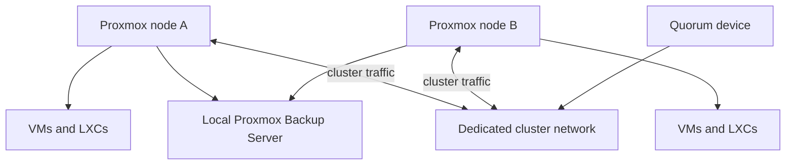

# Proxmox cluster

## Role

Proxmox VE is the compute layer for the homelab. It hosts infrastructure services, application platforms, home automation, storage-facing workloads and the JARVIS environment as VMs or LXCs.

## Cluster design

The cluster network is kept separate from general client and application traffic. A quorum device supports the two-node cluster design.

## Guest placement

Workloads are separated by responsibility rather than placed on one general-purpose host:

- infrastructure services such as DNS and source control;
- the central Docker deployment host;
- the GPU-backed AI server;
- Home Assistant;
- the Hermes/JARVIS runtime;
- storage and backup systems.

See the [system catalogue](../systems/index.md) for the current documented systems.

## Memory and capacity planning

The memory plan should show both configured allocations and operational headroom. Exact node totals and current guest allocations still need a verified export before they are published.

The intended table is:

| Layer | What will be recorded | Why it matters |
| --- | --- | --- |
| Physical nodes | Installed RAM and reserved host headroom | Prevents guest pressure from destabilising the hypervisor |
| Fixed-memory guests | Databases, storage and latency-sensitive services | Makes capacity requirements explicit |
| Ballooned guests | General Linux services where dynamic memory is acceptable | Allows controlled consolidation |
| AI workloads | VM memory, GPU memory and concurrency limits | Captures the full cost of model serving |
| Recovery reserve | Capacity required to restart important guests after a node failure | Determines whether HA placement is realistic |

### Evidence required before publishing exact values

- output from the current Proxmox node and guest configuration;
- whether memory ballooning is enabled per guest;
- normal and peak memory observations;
- the capacity available when one node is unavailable.

## High availability

Cluster membership, quorum and automated guest HA are related but different. This draft does not claim that every guest is automatically highly available.

The final page should record:

- which guests are managed by Proxmox HA;
- their HA groups and placement restrictions;
- storage dependencies that affect restart on another node;
- quorum behaviour during node or network loss;
- the expected restart sequence;
- a tested recovery result.

If the current deployment only provides clustered management and manual recovery, it should be described that way. The university PE2 Ceph/HA project is separate evidence and must not be presented as the storage design of this home cluster unless the same design is actually deployed here.

## Operational responsibilities

- patch and reboot nodes without losing track of guest placement;
- monitor node, storage and backup health;
- preserve quorum and cluster-network connectivity;
- maintain enough headroom for recovery;
- verify important guests after migration, restart or update;
- test restoration rather than treating completed backup jobs as proof of recovery.

## Skills demonstrated

Proxmox VE, KVM, LXC, cluster networking, quorum design, resource planning, backup integration, HA reasoning and failure-domain analysis.
