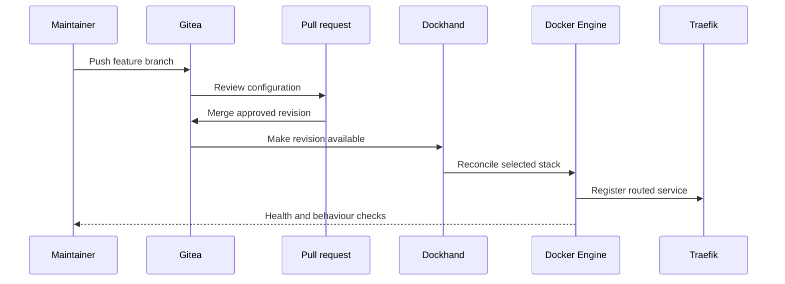

# Docker platform

## Role

The Docker platform hosts shared applications on the `docker-deploy` VM. Gitea stores deployment configuration, Dockhand applies approved stacks, and Traefik provides the common HTTP/HTTPS edge.

## Verified components

A live inventory during this documentation update confirmed these groups:

| Stack | Components |
| --- | --- |
| Edge and delivery | Traefik, Dockhand |
| Automation | n8n |
| MCP | Docker MCP, MCP Gateway |
| Memory | Honcho API, deriver, PostgreSQL/pgvector, Redis |
| Photos | Immich server, PostgreSQL, Valkey/Redis |

Image tags and container identifiers are intentionally omitted because they change frequently and belong in private deployment records.

## CI/CD path

This is GitOps-style delivery rather than a claim of fully autonomous CI/CD. Some deployments are triggered manually, and service publication remains a deliberate step.

## Traefik reverse proxy

Traefik provides stable application routes and central TLS termination for selected services. Internal databases and administrative endpoints are not intended to be routed as public applications.

Routing configuration should document:

- the route's purpose;
- the target service and port role;
- authentication requirements;
- internal-only versus externally reachable scope;
- certificate source and renewal ownership;
- health-check behaviour.

## Stack boundaries

Each major stack has its own Gitea deployment repository:

- `deploy/dockhand`
- `deploy/honcho`
- `deploy/immich`
- `deploy/mcp-stack`
- `deploy/n8n`
- `deploy/traefik`

This keeps updates and rollback targets focused. Secrets remain in the runtime environment rather than the repositories.

## Operations

- review configuration through a branch and PR;
- deploy the smallest affected stack;
- inspect container health and startup logs;
- verify the routed application from a client path;
- check dependent databases or APIs;
- restore the known-good revision when an update fails;
- treat schema and persistent-data changes separately from container rollback.

## Evidence to add

- sanitised Traefik route example;
- deployment PR and Dockhand reconciliation example;
- stack health-check script;
- failed deployment and rollback case study;
- dependency and data-ownership matrix.

## Skills demonstrated

Docker, Compose, Gitea, CI/CD design, Dockhand, Traefik, TLS termination, health verification, secret separation and rollback planning.
