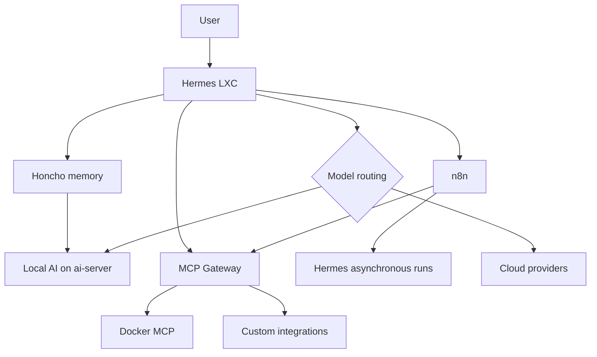
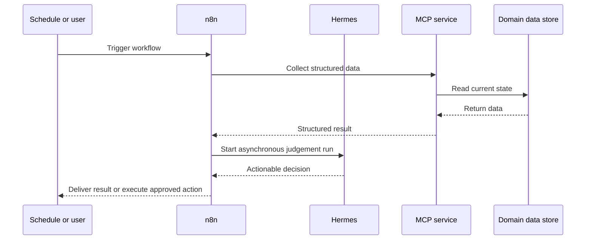

# JARVIS platform

## Purpose

JARVIS is a distributed assistant and automation platform assembled from several specialised systems. Hermes is the visible runtime, while memory, local inference, integrations and recurring workflows run on the systems best suited to them.

## Components

| Component | Placement | Responsibility |
| --- | --- | --- |
| Hermes LXC | Dedicated Proxmox guest | Conversation runtime, gateway, dashboard, skills and tool orchestration |
| Honcho | Docker platform | Durable conversational memory and derived context |
| Local AI models | AI server | Qwen language model and Nomic embeddings for persistent lightweight work |
| MCP Gateway | Docker platform | Aggregates custom integrations behind a common interface |
| Docker MCP | Docker platform | Restricted Docker operations through a tool interface |
| n8n | Docker platform | Durable schedules, integrations and deterministic workflow logic |
| Cloud model providers | External | Hard reasoning and model escalation when local capacity is insufficient |

## Responsibility boundaries

### Hermes

Interprets requests, applies operational policy, selects tools and presents results.

### Honcho and local AI

Maintain durable context without sending every memory operation to a large external model. Raw operational datasets remain in their domain systems rather than being copied into conversational memory.

### MCP stack

The MCP Gateway exposes authorised integrations. Docker MCP provides a bounded way to inspect and manage containers. Custom services can be added behind the gateway without teaching Hermes a different transport for each one.

### n8n

Runs recurring and deterministic workflows. It schedules work, integrates services and calls Hermes asynchronously when judgement is required. It is not used merely as a visual place to store arbitrary scripts.

## Example task flow

## Security and cost controls

- capabilities are explicitly authorised;
- new MCP infrastructure is not deployed automatically;
- secrets remain outside public repositories;
- high-frequency sensor events do not create unnecessary AI turns;
- local models handle suitable persistent work;
- stronger providers are reserved for tasks that justify them;
- external side effects require verification before success is reported.

## Operations

- verify Hermes gateway and dashboard health;
- test MCP calls after integration changes;
- monitor Honcho API, database, cache and deriver health;
- confirm local model identifiers and real end-to-end requests;
- validate and version n8n workflows;
- inspect Docker state before restarting or cleaning anything;
- keep routing and fallback behaviour documented.

## Evidence to add

- sanitised request and data-flow examples;
- one version-controlled n8n workflow;
- MCP service catalogue without credentials;
- model-routing decision record;
- incident showing diagnosis across Hermes, n8n, Docker and local AI.

## Skills demonstrated

Agent architecture, asynchronous workflows, model routing, memory systems, MCP, n8n, Docker operations, API integration, security boundaries and cost-aware design.
