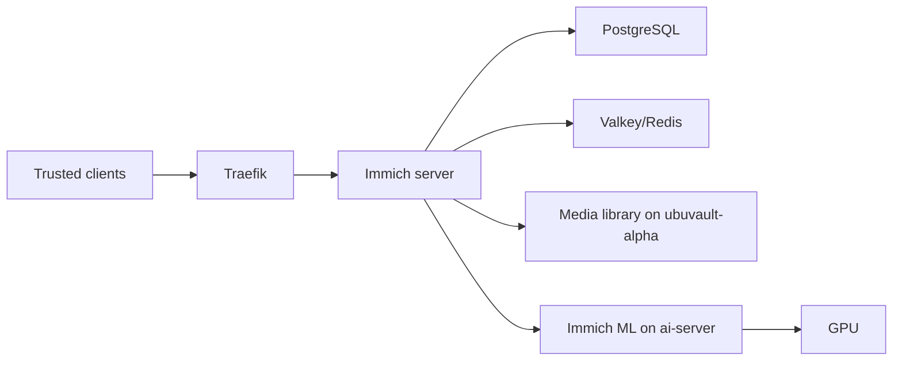

# Immich

## Role

Immich manages the personal photo and video library. Its application core runs on the Docker platform, the media library is stored on `ubuvault-alpha`, and machine-learning work uses the GPU-backed AI server.

## Architecture

A live Docker inventory confirmed the Immich server, PostgreSQL and cache on the central Docker host. The machine-learning component is separated to the AI server so it can use the available GPU.

## Data ownership

Immich has several distinct forms of state:

| State | Owner | Recovery concern |
| --- | --- | --- |
| Original photos and videos | NAS | File integrity, permissions, capacity and independent backup |
| Application metadata | PostgreSQL | Consistent database backup and compatible restore |
| Cache and transient jobs | Valkey/Redis | Usually rebuildable, but still part of service startup |
| ML models and indexes | ML service | Rebuild/download path and GPU availability |
| Deployment configuration | Gitea repository | Review and rollback of non-secret configuration |

Protecting only the media directory does not reproduce the complete Immich experience. Database and configuration recovery must be documented separately.

## Operations

- update the server, database and ML components with compatibility in mind;
- confirm the NAS mount before accepting uploads;
- monitor database, cache and application health;
- preserve GPU headroom for ML jobs;
- verify search, upload and thumbnail behaviour after updates;
- back up both media files and application metadata;
- avoid treating a container rollback as a database rollback.

## Security and privacy

The photo library is private data. The public repository excludes media, account information, internal paths, access tokens, face-recognition data and application exports.

## Evidence to add

- sanitised data-flow diagram with failure paths;
- backup ownership and restore sequence;
- an update verification checklist;
- proof of NAS mount and upload-path checks without exposing private paths;
- resource comparison for CPU versus GPU machine learning.

## Skills demonstrated

Stateful container operations, PostgreSQL, cache services, NAS integration, GPU workload placement, reverse proxying, backup design and privacy-aware documentation.
