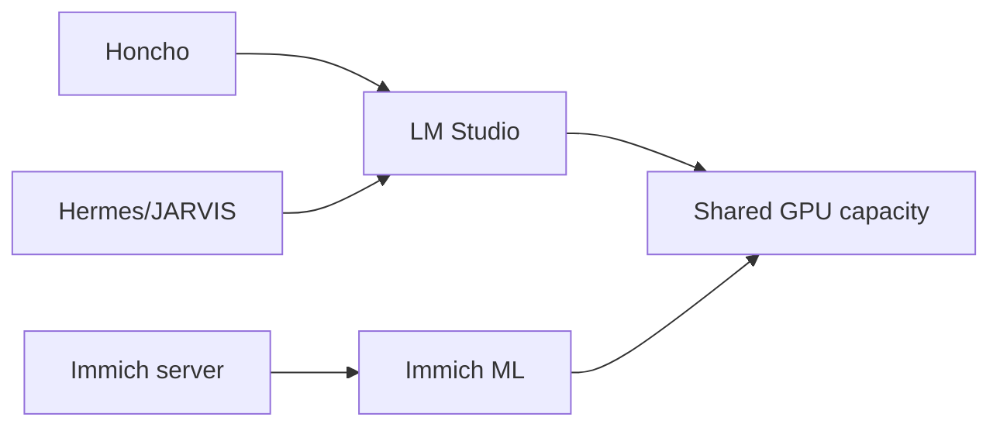

# AI server

## Role

The AI server provides GPU-backed compute for local language models, embeddings and media machine-learning workloads.

## Placement and dependencies

| Property | Public description |
| --- | --- |
| Runtime | Dedicated VM with GPU access |
| Model serving | LM Studio OpenAI-compatible endpoint |
| Consumers | Honcho and selected JARVIS workflows |
| Other workload | Immich machine learning |
| Trust | Internal service access only |

## Capacity model

The server hosts a small persistent language model and a lightweight embedding model while retaining headroom for Immich and future work. Model size, context length, KV cache, concurrency, system RAM, GPU memory and disk usage all affect practical capacity.

The current memory-service path uses a small Qwen model and Nomic embeddings. Heavy reasoning is routed through the main JARVIS provider path rather than forcing the local model to handle every task.

## Operations

- confirm the expected models are loaded;
- check the serving API and exact model identifiers;
- verify a real request through Honcho after model changes;
- monitor GPU, RAM and disk pressure;
- coordinate persistent model loading with media ML jobs;
- keep a documented fallback when local inference is unavailable.

## Security boundary

The serving endpoint is internal. Public documentation excludes exact addresses, access credentials and remote administration details.

## Evidence to add

- sanitised VM resource allocation;
- GPU memory under normal and competing workloads;
- model latency and reliability comparison;
- health checks through both LM Studio and Honcho;
- storage lifecycle for downloaded models.

## Skills demonstrated

GPU-backed VM design, local model serving, embeddings, model routing, capacity planning, API verification and workload isolation.
