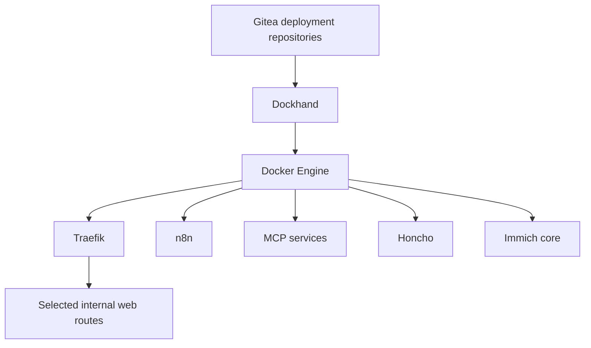

# Docker deploy

## Role

Docker deploy is the central application host. It runs shared platform services, exposes selected web applications through Traefik and receives Git-managed stack updates through Dockhand.

## Verified live platform

The current Docker inventory includes:

- Traefik;
- Dockhand;
- n8n;
- Docker MCP and MCP Gateway;
- Honcho API, deriver, PostgreSQL/pgvector and Redis;
- Immich server, PostgreSQL and Valkey/Redis.

Individual containers change more often than the host role, so exact image tags belong in the private deployment repositories.

## Deployment model

Non-secret Compose configuration lives in focused repositories. Changes move through branches and pull requests before Dockhand applies the approved version. Runtime secrets remain outside Git.

The deployment is complete only after service health and useful behaviour have been checked.

## Data ownership

Docker containers are replaceable; application data is not. Each stack must document its database, files, backup method and compatibility requirements separately.

## Operations

- inspect disk use before cleanup;
- review image and build-cache ownership;
- deploy one stack at a time when possible;
- check health, logs and reverse-proxy behaviour after updates;
- keep rollback revisions and application-aware recovery notes;
- avoid broad pruning without proving what is unused.

## Security boundary

Traefik is the application edge. Management ports, Docker control and internal databases are not intended as public services.

## Evidence to add

- sanitised stack map;
- one deployment and rollback transcript;
- disk-pressure incident case study;
- health-check examples;
- data-volume and backup ownership table.

## Skills demonstrated

Docker, Docker Compose, reverse proxying, GitOps-style delivery, container health, storage troubleshooting, rollback and multi-service operations.
