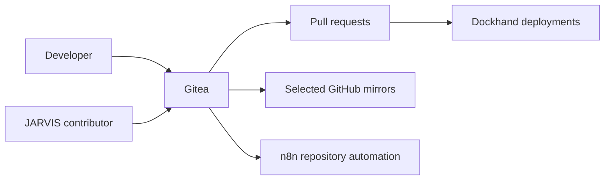

# Gitea

## Role

Gitea is the internal source-control service for school projects, deployment repositories and infrastructure documentation.

## Placement and integrations

| Integration | Purpose |
| --- | --- |
| Developer clients | Clone, branch, commit and review work |
| Dockhand | Read approved deployment repositories |
| n8n | React to selected repository and pull-request events |
| GitHub mirrors | Publish chosen repositories to a public portfolio |
| JARVIS | Review and update authorised repositories through a dedicated account |

## Repository model

Deployment repositories remain intentionally small. They track the configuration required to operate a stack without copying upstream source code or committing runtime secrets.

The public homelab repository is authored in Gitea and mirrored to GitHub. Gitea remains the working source of truth.

## Operations

- maintain least-privilege users and tokens;
- use feature branches and pull requests for meaningful changes;
- protect credentials from logs and commits;
- back up repositories and Gitea application data;
- verify mirrors and deployment webhooks;
- keep automation idempotent and deduplicated.

## Security boundary

The public documentation omits access tokens, webhook secrets, SSH details and private repository contents.

## Evidence to add

- sanitised repository organisation;
- branch-to-deployment flow;
- mirror verification;
- pull-request example;
- Gitea backup and restore procedure.

## Skills demonstrated

Git administration, Gitea, repository organisation, pull requests, least privilege, webhooks, mirroring and CI/CD integration.
