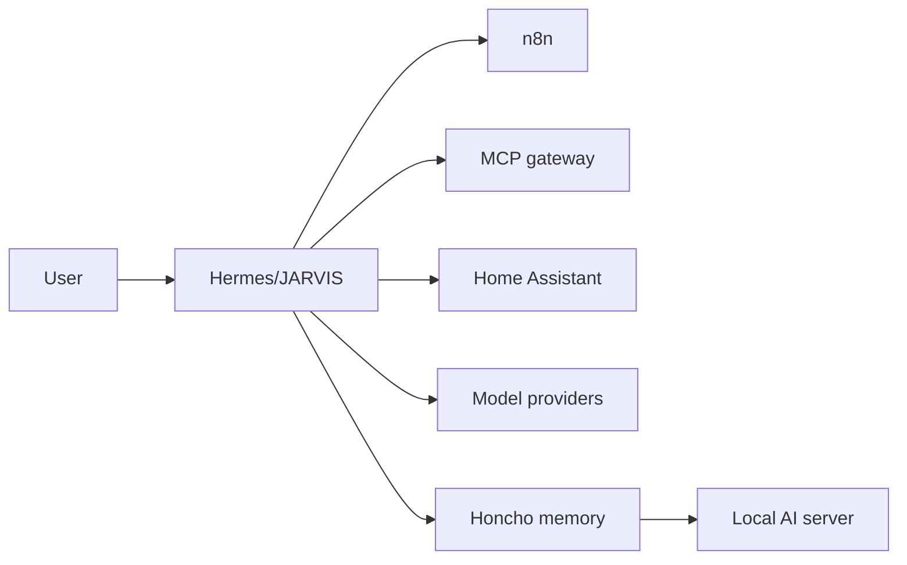

# Hermes

## Role

Hermes is the runtime for JARVIS. It provides the conversation layer, gateway, dashboard, skills, tool orchestration and access to external systems through authorised integrations.

## Platform relationships

Hermes is documented as a system because it has its own runtime and service lifecycle. The broader JARVIS platform includes components running on Docker deploy and the AI server.

## Responsibilities

- route user requests to the appropriate tools and models;
- apply domain-specific skills and operational rules;
- launch asynchronous runs for durable automation;
- keep raw domain data in the appropriate system of record;
- use Honcho for durable conversational context;
- present verified outcomes rather than plausible status reports.

## Operations

- monitor gateway and dashboard services;
- verify tool availability after configuration changes;
- keep provider and capability configuration separate from secrets;
- diagnose stuck runs from logs and process state;
- test integrations through real requests;
- control model cost and escalation paths.

## Security boundary

Hermes can operate infrastructure and connected services, so capability access is treated as privileged. The public repository excludes credentials, session data, personal memory and tool-access configuration.

## Evidence to add

- sanitised runtime architecture;
- asynchronous run example;
- tool-routing example;
- gateway health-check sequence;
- incident analysis showing diagnosis from process and log state.

## Skills demonstrated

Agent orchestration, API integration, model routing, asynchronous workflows, capability security, observability and operational troubleshooting.

See [JARVIS platform](../platforms/jarvis-platform.md) for the complete stack.
