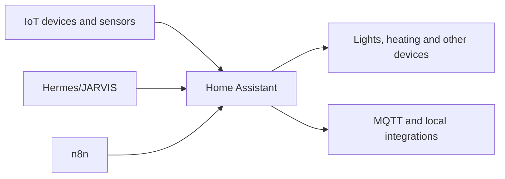

# Home Assistant

## Role

Home Assistant is the control plane for smart-home devices, automations and selected sensor data.

## Placement and relationships

The Home Assistant guest is separated from the general Docker application host. IoT devices live in their own network zone, and only required flows should cross into trusted services.

## Responsibilities

- maintain device state and local integrations;
- run deterministic home automations;
- expose selected entities to JARVIS and n8n;
- preserve safe device behaviour when an external AI or cloud service is unavailable;
- keep presence and motion events from creating unnecessary AI workloads.

## Operations

- validate configuration before restart where supported;
- apply updates with a backup and rollback path;
- verify API and device behaviour after restart;
- distinguish reported state from physical device behaviour;
- diagnose radio, network and mechanical failures separately.

## Security boundary

The public repository excludes entity identifiers tied to private routines, presence history, access tokens, addresses, camera data and complete automation exports.

## Evidence to add

- sanitised integration architecture;
- one deterministic automation example;
- one state-versus-physical-device troubleshooting case;
- backup and restore notes;
- network flow between IoT and Home Assistant zones.

## Skills demonstrated

Home Assistant, IoT integration, MQTT, network isolation, automation design, API control and physical-system troubleshooting.
