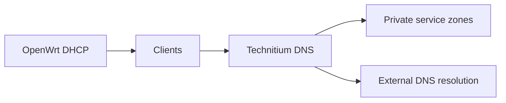

# Technitium DNS

## Role

Technitium DNS provides internal name resolution and hosts the private DNS zone used by infrastructure and application services.

## Placement and dependencies

| Property | Public description |
| --- | --- |
| Runtime | Dedicated infrastructure guest |
| Upstream | OpenWrt advertises the resolver to clients through DHCP |
| Downstream | Management interfaces, reverse-proxy routes and service-to-service names |
| Trust | Internal networks only |

## Design

Important infrastructure names are maintained explicitly rather than relying only on dynamic client leases. Application names can resolve to the reverse-proxy edge, while administration names resolve directly to the appropriate internal system.

The DNS server separates internal naming from public DNS and supports future certificate automation that requires controlled records.

## Operations

- maintain private zones and infrastructure records;
- review forwarders and recursion policy;
- confirm DHCP clients receive the intended resolver;
- test both direct DNS queries and normal client resolution;
- back up zone and server configuration;
- retain a rollback path when changing zone authority.

## Security boundary

The public portfolio omits the private namespace, live records, addresses, API credentials and administrative interface details.

## Evidence to add

- sanitised zone structure;
- representative direct and client-side lookup tests;
- DNS migration case study;
- backup and restore procedure;
- example split between infrastructure and reverse-proxy records.

## Skills demonstrated

DNS administration, DHCP integration, private zones, name-resolution troubleshooting, migration planning and rollback.
