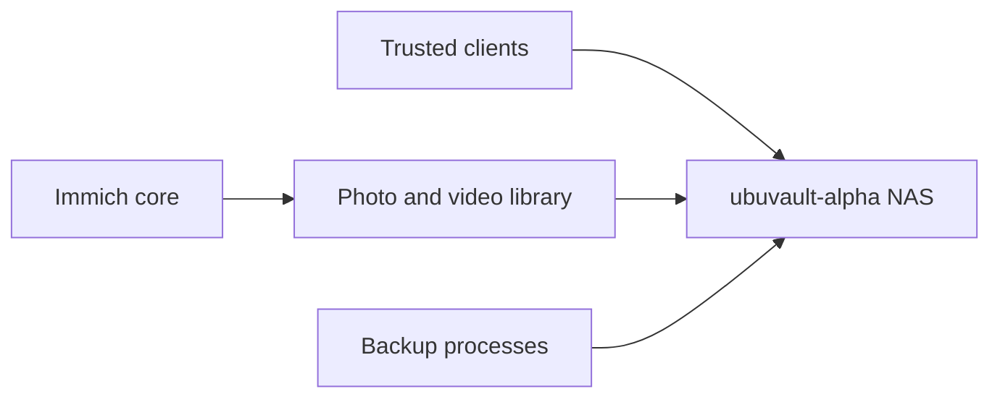

# ubuvault-alpha

## Role

`ubuvault-alpha` is the NAS and persistent storage system for data that should not live only inside an application VM. Immich uses it for the photo and video library.

## Storage relationships

## Data ownership

The NAS owns persistent file data, while applications own separate metadata and databases. For Immich, protecting the media library alone is not equivalent to protecting the application database.

The final documentation should record:

- underlying storage and filesystem layout;
- redundancy model;
- exported protocols and access controls;
- snapshot or backup schedule;
- capacity monitoring;
- which datasets are application data, user data or backup targets.

## Operations

- monitor capacity and disk health;
- keep permissions consistent across consuming systems;
- distinguish redundancy from backup;
- verify application mounts after host or network changes;
- document recovery for both files and dependent databases.

## Security boundary

The public portfolio omits share names, exact mount paths, user identities and storage credentials.

## Evidence to add

- sanitised storage-layer diagram;
- capacity and health monitoring example;
- Immich data-path verification;
- restore test for representative files;
- explanation of redundancy versus backup.

## Skills demonstrated

Network storage, Linux permissions, application data separation, capacity planning, disk health, backup reasoning and service dependencies.
