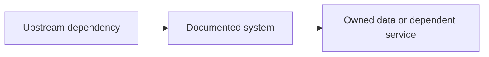

# Service-page template

Use this outline when documenting another VM, LXC, host or major service.

## Role

What responsibility does the system own?

## Why it exists

Which problem does it solve, and why is it separate from other systems?

## Placement

| Property | Value |
| --- | --- |
| Runtime type | VM, LXC, bare metal or container |
| Platform | Hosting node or platform role |
| Trust zone | Public description only |
| Criticality | Low, medium or high |

## Dependencies

## Data ownership

What persistent state belongs to this service? Where is it backed up? Which state is recreated from Git?

## Operations

- deployment or provisioning;
- updates;
- health checks;
- backup and restore;
- rollback;
- common failure modes.

## Security boundary

Which clients and services should reach it? Which details must remain private?

## Evidence

- configuration fragment;
- screenshot;
- health check;
- restore test;
- incident or migration note.

## Production improvements

What would be different with enterprise hardware, staffing, compliance and availability requirements?

## Skills demonstrated

List only skills supported by the page.
